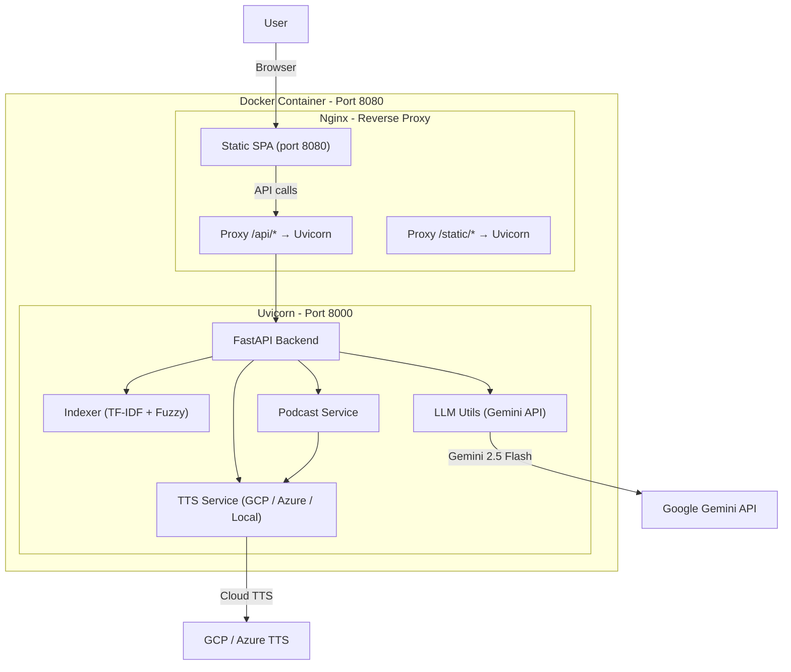
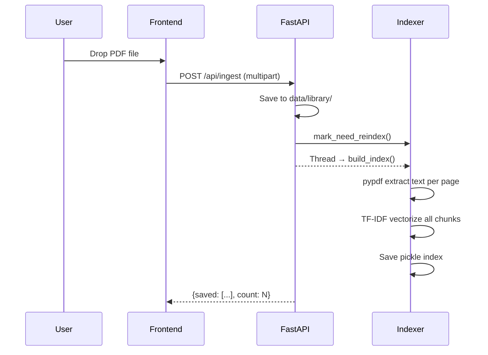
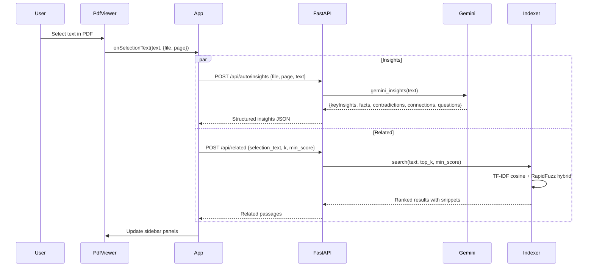
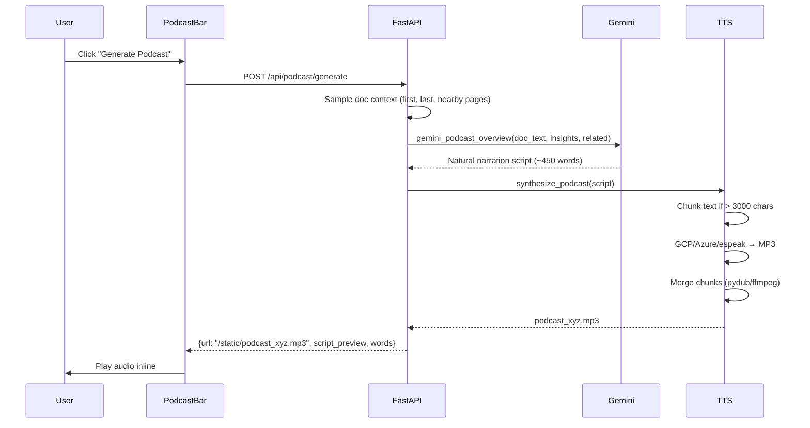

# AcroLens — Intelligent PDF Workbench

## Complete Project Description

---

## 1. Overview

**AcroLens** is a document intelligence web application built for the **Adobe India Hackathon 2025**. It transforms the way users interact with PDFs — going far beyond just reading. Users can upload multiple PDFs, get AI-generated insights per page, discover semantically related passages across their entire document library, and even listen to a podcast-style audio summary of any document.

> **Tagline:** *"See beyond the pages — Understand PDFs in minutes, not hours."*

---

## 2. Key Features

| Feature | Description |
|---|---|
| **Multi-PDF Upload** | Upload and manage multiple PDF documents in a single session |
| **AI-Powered Insights** | Per-page or per-selection bullet-point analysis: key insights, facts, contradictions, connections, and questions — all grounded in the document text |
| **Semantic Search (Related Sections)** | A hybrid TF-IDF + fuzzy matching search engine links passages across your entire PDF library |
| **Podcast Mode** | Generate a 2–5 minute narrated audio overview of any document using Google Cloud TTS, Azure TTS, or local espeak-ng |
| **Progressive Processing** | Start interacting immediately while background indexing and analysis continue |
| **PDF Viewer with Selection** | Embedded PDF viewer (using `pdfjs-dist`) with text selection that triggers real-time insights and related-section lookup |
| **Privacy-First** | All indexing is local; no external knowledge is injected — results are grounded solely in your uploaded documents |

---

## 3. Architecture



### Deployment Model
- **Single Docker container** with a multi-stage build:
  - **Stage 1:** Node.js 20 Alpine builds the Vite/React frontend → outputs to `/web`
  - **Stage 2:** Python 3.11 slim runs FastAPI + Nginx
- **Nginx** serves the built SPA and reverse-proxies `/api/*`, `/static/*`, and `/config.js` to Uvicorn on `127.0.0.1:8000`
- Both processes are supervised by a bash start script with job control

---

## 4. Tech Stack

### Frontend

| Technology | Version | Purpose |
|---|---|---|
| **React** | 19.1.1 | UI framework (functional components, hooks) |
| **Vite** | 7.1.2 | Build tool & dev server |
| **pdfjs-dist** | 5.4.54 | Client-side PDF rendering and text extraction |
| **Tailwind CSS** | 4.1.12 | Utility-first styling (with PostCSS) |
| **ESLint** | 9.33.0 | Code quality |

### Backend

| Technology | Version | Purpose |
|---|---|---|
| **Python** | 3.11 | Runtime |
| **FastAPI** | 0.116.1 | Web framework (async, Pydantic models, auto docs) |
| **Uvicorn** | 0.35.0 | ASGI server |
| **pypdf / PyPDF2** | 6.0.0 / 3.0.1 | PDF text extraction |
| **scikit-learn** | 1.7.1 | TF-IDF vectorizer + cosine similarity |
| **RapidFuzz** | 3.13.0 | Fuzzy string matching for hybrid search |
| **sentence-transformers** | 5.1.0 | (Available for semantic embeddings) |
| **PyTorch** | 2.8.0 | ML backend for transformers |
| **google-generativeai** | ≥0.7.0 | Google Gemini API client |
| **Pydantic** | 2.11.7 | Request/response validation |
| **python-dotenv** | 1.1.1 | Environment variable management |

### AI & ML

| Component | Technology | Details |
|---|---|---|
| **LLM Provider** | Google Gemini 2.5 Flash | Generates insights (structured JSON) and podcast scripts |
| **Search Engine** | TF-IDF (scikit-learn) + RapidFuzz | Hybrid cosine similarity + token-set/partial fuzzy matching |
| **Embeddings** | sentence-transformers (available) | HuggingFace transformer models (dependency present) |

### Text-to-Speech (TTS)

| Provider | Technology | Notes |
|---|---|---|
| **Google Cloud TTS** | `google-cloud-texttospeech` | Neural2 voices, configurable rate/pitch |
| **Azure OpenAI TTS** | REST API | Alternative cloud provider |
| **Local (espeak-ng)** | `espeak-ng` CLI | Offline fallback |
| **Audio Processing** | `pydub` + `ffmpeg` | MP3 chunk merging for long scripts |

### DevOps & Infrastructure

| Component | Technology |
|---|---|
| **Containerization** | Docker (multi-stage build) |
| **Web Server** | Nginx (SPA serving + reverse proxy) |
| **Process Management** | Bash job control (`wait -n`) |
| **Environment Config** | `.env` files + runtime env vars via `/config.js` endpoint |

---

## 5. Project File Structure

```
Adobe-Round3/
├── .env                          # Root env (Adobe Embed API key)
├── Dockerfile                    # Multi-stage: Node build → Python runtime + Nginx
├── README.md                     # Project documentation
│
├── backend/
│   ├── .env                      # Backend secrets (Gemini API key, TTS config)
│   ├── requirements.txt          # Python dependencies (52 packages)
│   ├── main.py                   # FastAPI app — all API endpoints (632 lines)
│   ├── indexer.py                # TF-IDF search index (build, search, page text)
│   ├── llm_utils.py              # Gemini API calls (insights + podcast script)
│   ├── tts_utils.py              # Legacy GCP TTS helper
│   ├── pdf_utils.py              # PDF parsing utilities
│   ├── services/
│   │   ├── __init__.py
│   │   ├── tts.py                # Multi-provider TTS (GCP, Azure, espeak-ng, chunking)
│   │   └── podcast_service.py    # Podcast synthesis orchestrator
│   └── data/
│       └── library/              # Uploaded PDFs stored here
│
├── frontend/
│   ├── package.json              # React 19 + Vite 7 + Tailwind 4
│   ├── vite.config.js            # Vite configuration
│   ├── tailwind.config.js        # Tailwind CSS config
│   ├── index.html                # SPA entry point
│   └── src/
│       ├── main.jsx              # React root + Landing/App routing
│       ├── App.jsx               # Main app layout (3-column: sidebar + viewer)
│       ├── App.css               # Global styles
│       ├── Landing.jsx           # Landing/hero page
│       ├── tailwind.css           # Tailwind base styles
│       ├── components/
│       │   ├── PdfViewer.jsx     # PDF rendering with pdfjs-dist + text selection
│       │   ├── InsightsBulb.jsx  # AI insights display (collapsible categories)
│       │   ├── RelatedPanel.jsx  # Related sections panel with navigation
│       │   ├── PodcastBar.jsx    # Podcast generation controls + audio player
│       │   ├── PodcastButton.jsx # Podcast trigger button
│       │   ├── UploadPanel.jsx   # PDF upload drag-and-drop
│       │   ├── LibraryPanel.jsx  # Document library listing
│       │   └── SelectionPreview.jsx # Selected text preview
│       ├── hooks/
│       │   └── UseInsights.js    # Custom hook for insights fetching
│       └── utils/
│           └── api.js            # API helper functions
```

---

## 6. API Endpoints

| Method | Endpoint | Purpose |
|---|---|---|
| `GET` | `/api/health` | Health check |
| `GET` | `/config.js` | Runtime configuration (Adobe API key, API base) |
| `GET` | `/api/library` | List all uploaded PDFs |
| `POST` | `/api/ingest` | Upload multiple PDFs |
| `POST` | `/api/upload` | Upload a single PDF |
| `GET` | `/api/file/{filename}` | Serve a PDF file for viewing |
| `POST` | `/api/related` | Find related passages for selected text |
| `POST` | `/api/insights` | Generate AI insights for selected text |
| `POST` | `/api/auto/insights` | Auto-generate insights for a page or selection |
| `POST` | `/api/auto/related` | Auto-find related content for a page |
| `GET` | `/api/index/status` | Check index status (files, chunk count) |
| `POST` | `/api/index/rebuild` | Force rebuild the search index |
| `POST` | `/api/podcast/generate` | Generate podcast audio from document |
| `GET` | `/static/{filename}` | Serve generated audio files |

---

## 7. Data Flow

### PDF Upload → Indexing


### Text Selection → Insights + Related


### Podcast Generation


---

## 8. Search Engine Design

The search system uses a **hybrid approach**:

1. **TF-IDF Vectorization** (scikit-learn)
   - `TfidfVectorizer` with English stop words, max 50k features, unigrams + bigrams
   - Cosine similarity against the query vector

2. **RapidFuzz Re-ranking**
   - `token_set_ratio` — order-independent fuzzy matching
   - `partial_ratio` — substring fuzzy matching
   - Takes the max of both scores

3. **Hybrid Score**
   - `hybrid = 0.65 × cosine + 0.35 × fuzzy` (configurable via env)
   - Threshold at 0.58 by default (caller can override)

4. **Best Snippet Extraction**
   - Sentences scored by `partial_ratio` against the query
   - Top 3 sentences (in original order) returned as a ~400 char snippet

5. **Multi-Pass Cascade** (frontend-driven)
   - Pass 1: Strict (min_score=0.58, k=8)
   - Pass 2: Relaxed (min_score=0.42, k=12)
   - Pass 3: Page-based auto-related fallback
   - Pass 4: Keyword sweep (individual keywords, min_score=0.0)

---

## 9. AI / LLM Integration

### Gemini 2.5 Flash
- **Insights Generation:** Structured JSON output with 5 categories (keyInsights, facts, contradictions, connections, questions)
  - Primary: `response_mime_type: "application/json"` for strict JSON
  - Fallback: Free-form text parsed into categories
  - Last resort: Naive extraction from source text
- **Podcast Script:** Natural spoken narration (~320–700 words) with:
  - Hook → coverage → 3–6 core ideas → contrasts → closing
  - No page numbers, no markdown, no lists — ear-friendly prose

---

## 10. TTS System

Three providers with automatic fallback:

| Provider | Config | Voice |
|---|---|---|
| **GCP** (default) | `GOOGLE_APPLICATION_CREDENTIALS` | `en-US-Neural2-F` (rate: 1.08x) |
| **Azure** | `AZURE_TTS_KEY` + `AZURE_TTS_ENDPOINT` | Configurable |
| **Local** | `espeak-ng` CLI | `en` (speed: 150 wpm) |

**Long text handling:** Scripts > 3000 chars are chunked at word boundaries, each chunk synthesized separately, then merged using pydub + ffmpeg. Graceful fallback to single-voice if pydub/ffmpeg is unavailable.

---

## 11. Key Design Decisions

| Decision | Rationale |
|---|---|
| **TF-IDF + Fuzzy over embeddings-only** | Faster cold start, no GPU needed, good for hackathon scope |
| **Single Docker container** | Simplicity for demo; nginx + uvicorn co-located |
| **Pickle-based index** | Fast serialize/deserialize; acceptable for local library scale |
| **Progressive indexing** | Background thread rebuilds index after upload — UI remains responsive |
| **Multi-pass search cascade** | Ensures the "Related" panel almost never shows empty |
| **Gemini JSON mode + fallback** | Strict JSON parsing with graceful degradation to free-form text |
| **Multi-provider TTS** | Flexibility for demo environments with/without cloud credentials |
| **pdfjs-dist (not Adobe Embed SDK)** | Direct PDF rendering in React without iframe limitations |

---

## 12. Environment Variables

### Root `.env`
| Variable | Value | Purpose |
|---|---|---|
| `VITE_ADOBE_EMBED_API_KEY` | `9f61ae...` | Adobe PDF Embed API key |

### Backend `.env`
| Variable | Example | Purpose |
|---|---|---|
| `GEMINI_API_KEY` | `AIzaSy...` | Google Gemini API key |
| `GEMINI_MODEL` | `gemini-2.5-flash` | LLM model to use |
| `TTS_PROVIDER` | `gcp` | Default TTS provider |
| `GOOGLE_APPLICATION_CREDENTIALS` | `service_account.json` | GCP service account path |
| `GCP_TTS_VOICE` | `en-US-Neural2-F` | Default TTS voice |
| `GCP_TTS_LANGUAGE` | `en-US` | TTS language code |
| `TTS_CLOUD_MAX_CHARS` | `3000` | Max chars per TTS chunk |
| `TTS_TARGET_WORDS` | `700` | Target podcast word count |
| `GCP_TTS_RATE` | `1.08` | Speaking rate multiplier |
| `GCP_TTS_PITCH` | `0.0` | Pitch adjustment |

---

## 13. How to Run

### Docker (Production)
```bash
docker build --platform linux/amd64 -t acrolens .
docker run -p 8080:8080 \
  -v /path/to/credentials:/credentials \
  -e ADOBE_EMBED_API_KEY=<key> \
  -e LLM_PROVIDER=gemini \
  -e GOOGLE_APPLICATION_CREDENTIALS=/credentials/adbe-gcp.json \
  -e GEMINI_MODEL=gemini-2.5-flash \
  -e TTS_PROVIDER=gcp \
  acrolens
```

### Local Development
```bash
# Backend
cd backend
pip install -r requirements.txt
uvicorn main:app --host 0.0.0.0 --port 5001 --reload

# Frontend
cd frontend
npm install
npm run dev    # → http://localhost:5173
```

---

> **Built for:** Adobe India Hackathon 2025
> **Team project name:** AcroLens
> **Core philosophy:** Privacy-first document intelligence — no external knowledge, only your PDFs.
